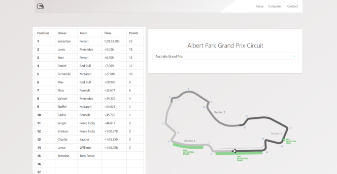
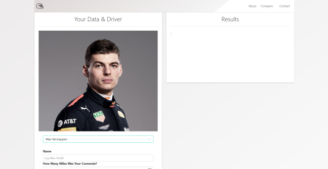

# NC_GrandPrix

For Formula 1 fans and everyone in between, NCGP allows users to compare their daily commute routes against Formula 1 drivers to see how quickly they could make the same trip based on recent race results. Up to date Formula 1 results are obtained from a Formula 1 API and users are able to choose which driver they would like to compare themselves to. Future additions will allow users that enjoy to race to compare thei own track results against drivers on a course of similar distance to their own.

[Click here to checkout NCGP!]( https://powerful-ocean-95718.herokuapp.com)

## Technologies Used
- [x] HTML5, Bulma, Javascript, jQuery, Express, Node, Sequelize

## Preview

On this screen users are able to choose a race from the drop down and view the current results. The table data and track picture are updated per users selection.

Here users can input their commute times, choose their prefered driver, and view results on the right container.

## TO DO:
1. Add functionality to allow users that track their cars to compare their track results with a Formula 1 driver on a Formula 1 track of similar length.

2. Add more current races and clean up API calls.

3. Make table and container elements mobile responsive.

